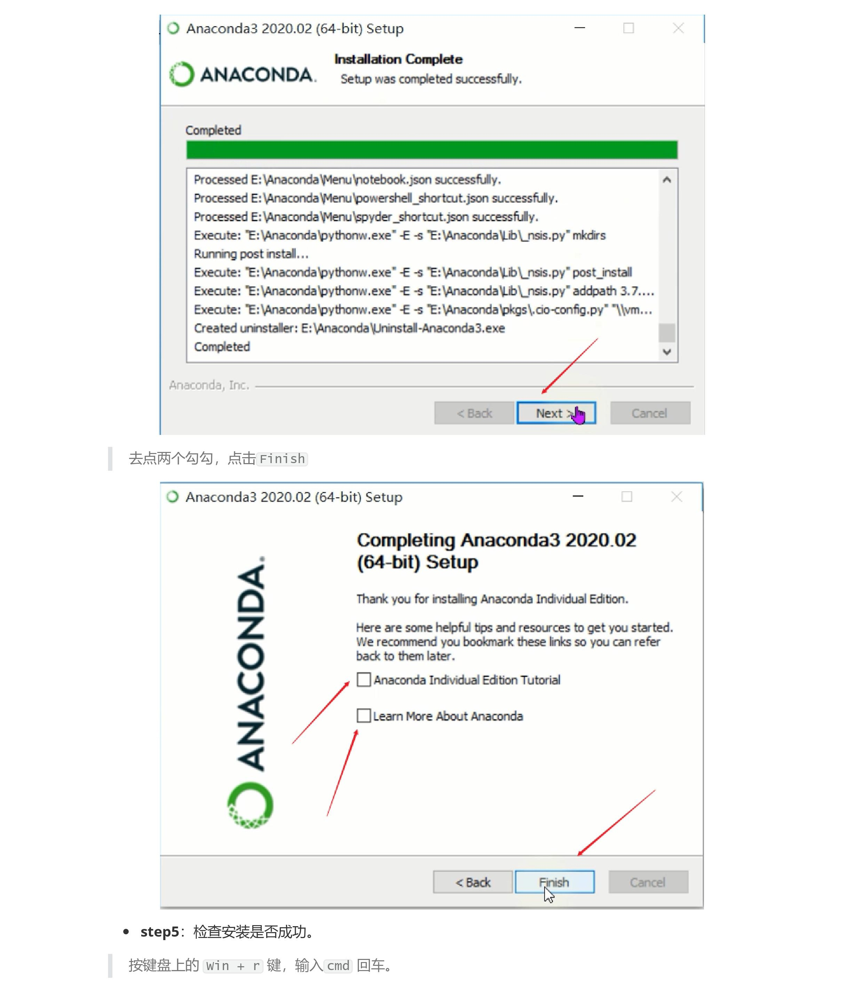
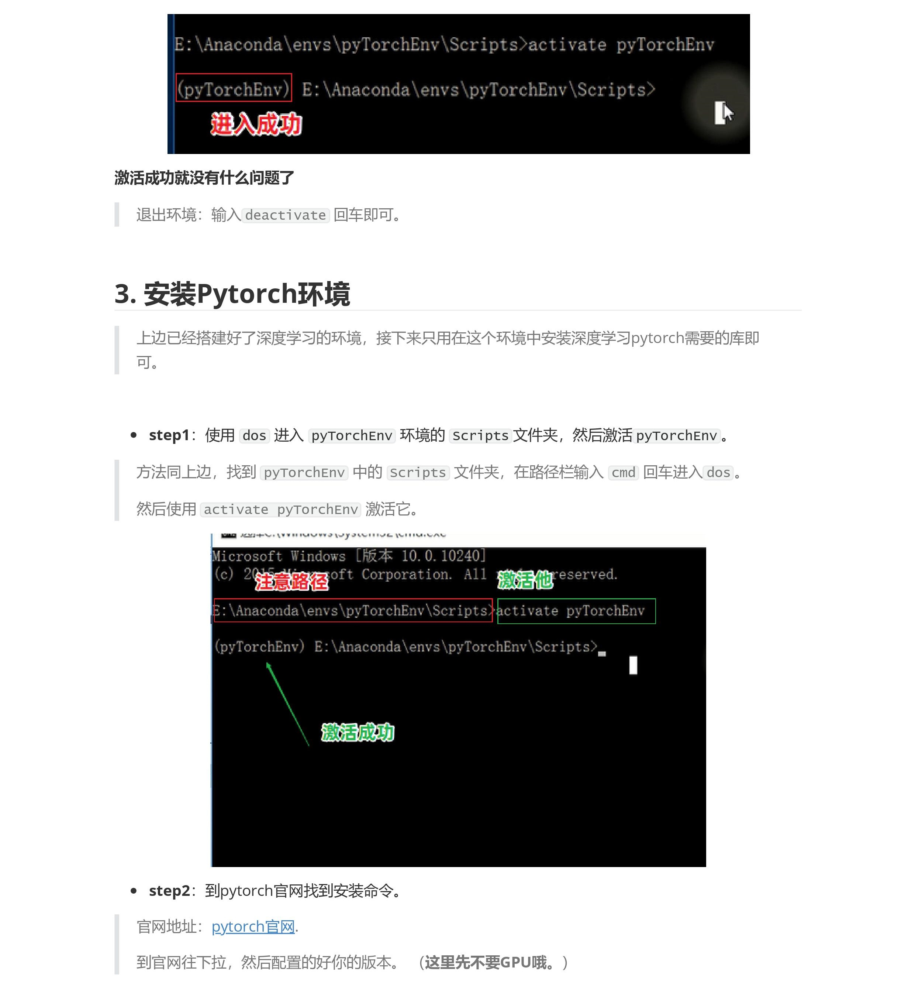
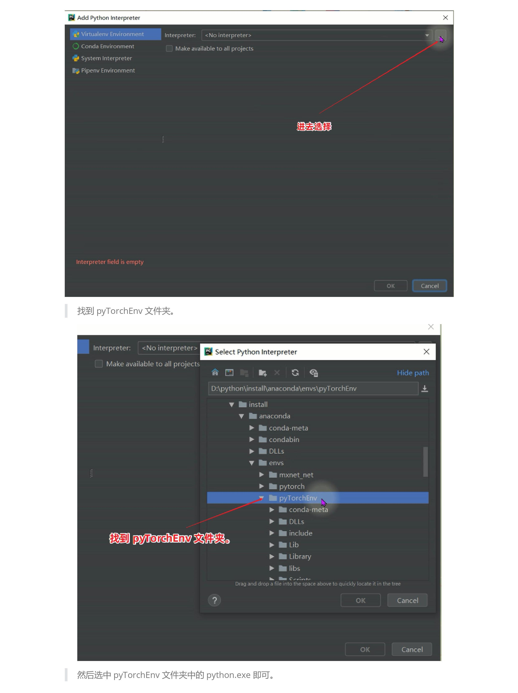

**Tips**：文中涉及到的链接已单独放置到文末，且可直接点击。

**链接**：

- 仓库地址：https://github.com/xiaoxiaojiea/myBlogSources.git
- anaconda官方下载地址：https://www.anaconda.com/products/individual
- 清华镜像源下载地址：https://mirrors.tuna.tsinghua.edu.cn/anaconda/archive/?C=M&O=D
- pytorch官网：https://pytorch.org

