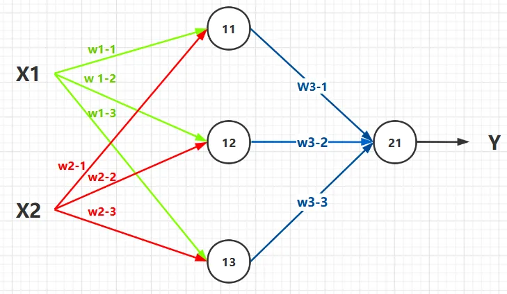
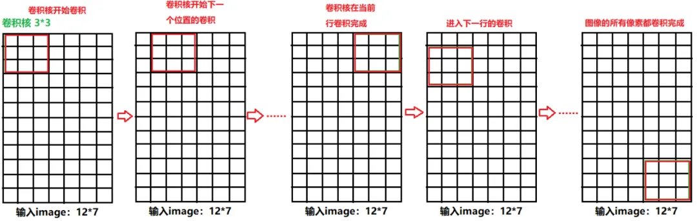
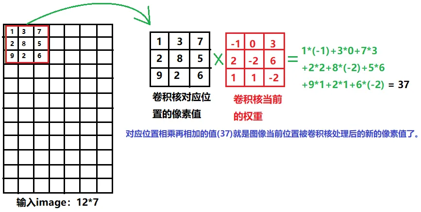
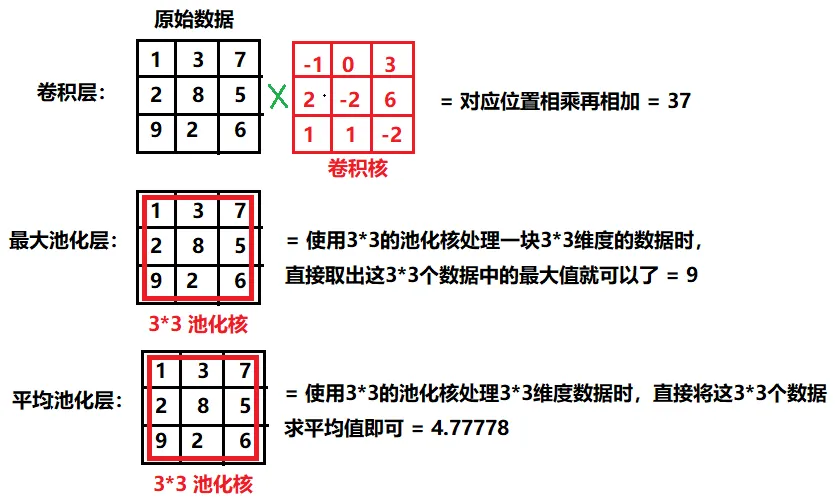
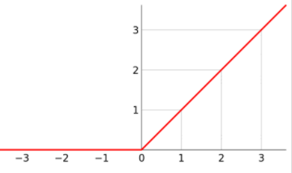
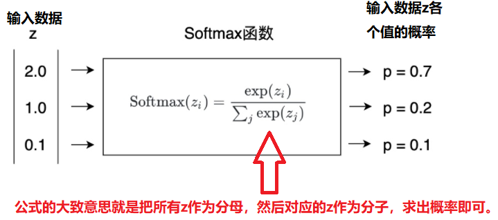

# 003-深度学习编码基础

**003-深度学习编码基础(PyTorch，卷积，池化，全连接，激活函数)**

> 在上边讲完了深度学习的基础知识以及数学基础之后，下边就要学习一些代码编写的基础了。
>
> 这里主要是使用 PyTorch 框架进行的。


**本节目录如下：**

- 前言。

- 全连接层。
- 卷积层。
- 池化层。
- 激活函数。
- Softmax。


## 0. 前言

前两节我们已经结束掉了基础知识的讲解，接下来的任务就是讲解一些代码的编写基础。

这里边的代码编写起始就是想方设法的把前文中提到的基础知识转化为计算机运算而已，所以如果你看明白了前那边的基础知识，这里就是简单的思维转换一下而已。

这里主要使用python语言，深度学习框架主要使用的是pytorch。

>python与pytorch的安装已经在第一节介绍过了。


## 1. 全连接层

大家应该还记得这张图：




这张图表达的内容就是全连接层所要表达的含义：总共有**x1，x2，11，12，13，21**六个节点，x1，x2两个节点属于输入层，11，12，13三个节点称之为隐藏层，21属于输出层。

他们之间的传递关系是：**输入数据—>隐藏层—>输出**。我们可以发现相邻两层之间的节点是全部进行两两连接的，这种情况我们就称之为全连接，这也就是全连接的来由。

各层之间的节点连接的目的是，想让整个全连接网络求出两两节点之间的权重，当网络学习到了一组较好的权重之后就可以使用这组权重+这组网络来预测未来的输入x1，x2.

**所以，应该怎样用pytorch代码来表示全连接层呢？**

很简单，代码如下：

``````python
import torch.nn as nn  # 导入torch的nn模块

linear1 = nn.Linear(in_features=2, out_features=3)  
# 使用nn模块创建一个全连接层（第一层(x1,x2)到第二层(11,12,13)之间的全连接）,第一个参数就是第一层的节点数，第二个参数就是第二层的节点数。

linear2 = nn.Linear(in_features=3, out_features=1)  
# 使用nn模块创建一个全连接层（第二层(11,12,13)到第三层(21)之间的全连接）,第一个参数就是第二层的节点数，第二个参数就是第三层的节点数。
``````

经过这样的代码表示，可以得到的信息是linear1中的参数就是2x3个（其实还有一个偏差，这里就不细讲了），linear2中的参数就是3x1个。这些参数就是待优化求解的参数。


## 2. 卷积层

上边的全连接层在实际的应用中一般都是用于向量之间的优化（上边的每一层数据都是列向量），但是实际生活中二维数据比较常见，而且再加上全连接层之间的参数量太大了（两个列向量之间全连接，每个连接之间都有一个参数，所以参数量太大了），所以提出了卷积层先处理二维图像，给图像提取深度特征并且降维处理，再使用全连接层提取特征。

**卷积层对图像处理可视化如下：**



从上边的处理流程可以看出来当我们给定一张`12*7`的图像，给定一个`3*3`的卷积核，则卷积核的作用就是类似于滑动窗口的方式遍历图像中的所有像素，然后卷积核框中的地方就会将图像像素值与卷积核的权重值相乘，形成一个数据值。

**卷积核对图像数据卷积处理如下图：**



针对图像的每一块经过卷积核处理之后都会得到新的特征值，然后整个图像都被卷积之后，图像维度就会减少了，但是图像会被提取到深度特征。

`3*3`的卷积核处理完`12*7`的图像之后，图像就会变成`10*5`维度的。

这就是卷积核的处理过程，对图像特征进行了深度提取，并且给图像也降低了维度，此时待学习的参数就是`3*3`卷积核里边每个位置对应的数据值（也就是9个数），这相对于全连接层而言，参数量少了很多。

**所以，应该怎样用pytorch代码来表示卷积层呢？**

很简单，代码如下：

```python
import torch.nn as nn  # 导入torch的nn模块

conv1 = nn.Conv2d(in_channels=1, out_channels=16, kernel_size=3, stride=1, padding=2)
# in_channels表示的是输入图像的通道(彩色图像就是RGB通道的，灰度图像就是单通道)，输入图像的in_channels是根据输入图像实际情况而定的，这个没得更改。
# out_channels表示你想把输入通道的图像升维到多少维度的通道，升高输入图像通道维度的目的是增加图像的信息提取能力，因为卷积过程中图像的尺寸在变小，为了防止特征越来越少，所以就提升通道维度。
# kernel_size就是卷积核的大小
# stride就是卷积核每次在图像中往右/往下滑动的距离
# padding当图像的宽高不能让卷积核正好覆盖的时候，可以使用该参数对图像填充0
```


## **3. 池化层**

上文介绍的全连接层与池化层都是会学习权重，并用权重来作用到输入数据中，此时我们介绍一个新的操作—池化层，他的特性就是能改处理输入数据（改变维度），但是不学习权重（也就是简单粗暴的修改输入数据维度）。

**池化层其实与卷积层是一个样子，但是他处理数据的时候不学习权重，具体实现如下：**



针对图像中的某一块区域，卷积核的作用就是学习卷积核大小维度的权重参数，然后将权重参数作用到各个像素中，再求出总和即可。但是池化层的作用虽然也是同样的处理，但是池化层不需要学习参数，最大池化就是取出范围内数据的最大值，平均池化就是取出范围内的平均值即可。

**pytorch的池化层代码如下所示：**

```python
import torch.nn as nn  # 导入torch的nn模块

m = nn.MaxPool2d(3, stride=2)  # MaxPool2d就是最大池化层，他的2d的意思就是他是二维卷积核
# 3的意思就是这个池化核的尺寸时3*3的，其实你也可以写 (3, 3) 
# stride=2的意思就是当前池化核处理完之后，池化核移动多少像素（这里是移动2个像素）。
m = nn.AvgPool2d(3, stride=2)  # AvgPool2d就是平均池化层
```


## **4. 激活函数**

训练过程中神经网络的可能会由于学习权重的变化，使得学习到的数据范围发生巨大的变化（比如说出现极大的负数，但是对于图像像素值来说是不可能出现负数的），所以就需要一定的策略来处理这些数据，所以就出现了激活函数。

**这里简单的介绍ReLU激活函数，他的处理思路如下图：**



思路很简单，负数全部给他变为0，正数不改变即可。

**pytorch中的ReLU激活函数的使用如下：**

```python
import torch.nn as nn  # 导入torch的nn模块

nn.ReLU()  # 显而易见，没啥说的
```


## **5. Softmax**

对于分类问题最终的输出应该是对每个类别预测的概率值（比如10个类别，那么最后应该输出10个数据，每个数据都是表明当前输入是对应类别的概率），但是全连接层输出不可能是概率值，所以就把全连接层最终输出的向量通过softmax转化为整体概率为1概率值。

**softmax的数学思想如下：**



softmax的思想其实很简单，就是把输入数据的exp相加作为分母，然后对应输入数据的exp除以分母就好了，这样就可以转换出概率值了（至于为什么数据都要用exp，因为防止数据大小出现很大的差距）。

**pytorch中的Softmax的使用如下：**

```python
import torch.nn as nn  
# 导入torch的nn模块

self.softmax = nn.Softmax(dim=1)  
# dim=1的意思是沿着数据的第二维度来做概率化操作
```


## 6. **结尾**

整个项目开始前，每个模块的组件都是这样了，下一节就准备开始做一个经典的项目**MNIST手写数字体识别**。


