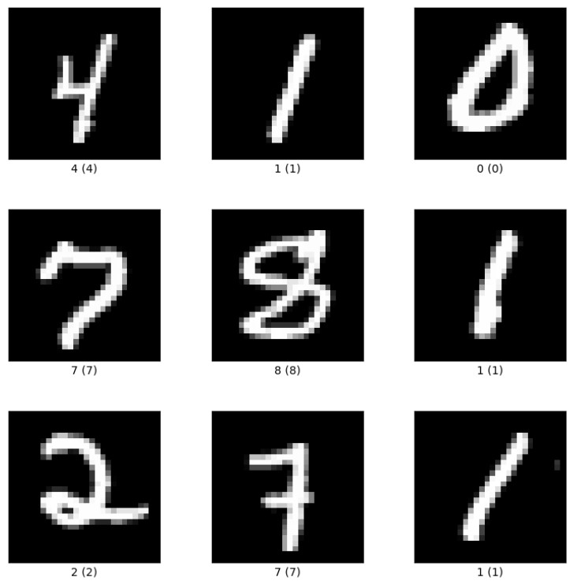
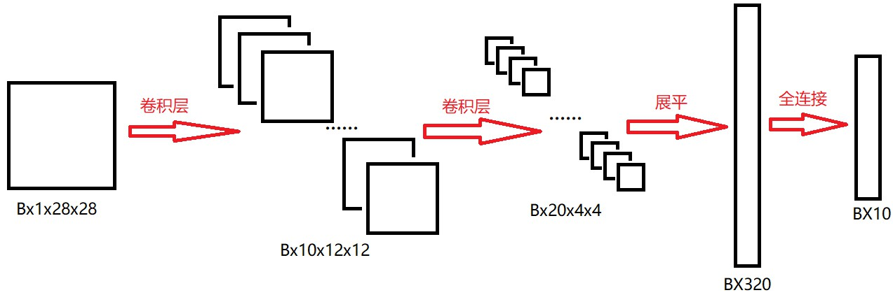

# MNIST手写体数字识别项目


## 环境配置

因为mnist项目耗费的资源并不是很多，所以通常CPU与GPU环境都能运行起来，考虑到初学者可能并没有GPU设备，所以我这里给出了两个环境配置的参数。并且实际下边代码开发过程中，GPU与CPU环境都是可以运行这份代码的。


**CPU环境**：这个很简单，只要你有一个电脑就可以了，然后使用conda创建一个新环境，环境版本配置建议如下：python3.8，pytorch1.9.1，其他的就参考我一开始的配置环境吧：https://mp.weixin.qq.com/s/mu-ePQBKiWupaZxIXwVCgQ


**GPU环境**：这个需要配置cuda驱动，然后安装python3.8，pytorch1.9.1，因为这个安装跟电脑显卡型号相关，大家自己百度吧，网上这种配置文章多的很。


## 项目介绍

### 引言

对于所有入门深度学习的同学来说，不管你使用的是什么深度学习框架（pytorch，tensorflow，mxnet，caffe等等），mnist手写体识别项目可以说是你人生中的第一个深度学习项目。

这个项目其实并不是很重要，但是他足够简单，并且涉及到的知识点将会在整个深度学习技术的学习中占据着举足轻重的地位。

就我个人来说，我一般新拿到一个电脑配置好GPU以及深度学习环境之后，我都会拿mnist项目来先跑一会，验证一下我的电脑配置是否可用。


## 理论知识

### 项目思路

- 首先，我们拿着mnist手写体数字数据集送入我们设计的神经网络。（这个数据集是经过标注的，一个图片中会存在一个手写体数字0~9，并且会有一个标注文件指示出这个图片中的数字是多少）。
- 其次，我们使用神经网络去提取数据集中的一个个图片的特征向量，然后再使用特征向量来做类别的预测。
- 然后，拿着神经网络预测的类别去和数据集中的真实类别进行损失计算，然后迭代更新参数，直到损失变到最小。
- 最后，得到训练好的神经网络参数，来预测输入的图片。


沿着这个思路，我们首先介绍**mnist数据集**，然后介绍神经网络的设计，然后介绍**训练过程**，然后再介绍预测过程。


### MNIST数据集

在这里我们需要确立一个思想，深度学习这个技术能够做到的事情是从大量已知的具有标注的数据中，学习对这些数据提取特征，并且基于这些提取到的特征去完成后续的任务。所以这里就会存在一个问题，神经网络的使用前提的我们能够得到数据集。

废话不多说，我们看看mnist手写体数字数据集长什么样子。



我们可以看到mnist数据集其实就是手工写的数字，就是有它对应的真实标注。因为这个数据集的图像分辨率只有28x28，所以看着有点糊。


**训练集：**该数据集有60000张训练图像。

**测试集：**该数据集有10000张测试图像。

训练集与测试集每张图像都有标注，共10个类别，每个类别代表0~9之间的一个数字，每张图像只有一个类别。

训练集是我们训练神经网络过程中用到的数据，测试集是我们拿训练集训练好的参数来直接推理得到预测结果，用于证明我们训练效果的。通常我们将测试集测试到的结果用来公布，说明我们训练的结果。


### 神经网络

这里的卷积神经网络要实现的功能如下：



首先，我们**输入**的是一张手写体数字图像，这个图像是灰度图所以他的通道是1（彩色图的通道的3），并且宽高都是28，所以他的维度是1x28x28。其中的B是我们网络训练过程中的batch（批次），它的含义是一次要送入神经网络B张图像（B的大小通常跟显卡的内存大小有关，显卡内存越大，B可以设置的越大）。

经过组合的**卷积层**（现在理解为卷积层就行，后边代码再细讲），我们将图像的维度从28减少到12，这个时候因为图像维度减少了，也就代表着特征相应减少，所以为了保证特征丰富性，我么将通道由原来的1增加到了10。（在神经网络设计的过程中有一个默认的操作就是特征提取过程中维度逐渐减少，通道逐渐增加）

第二次经过组合的**卷积层**，我们将图像维度减少到4，将图像通道增加到20。此时的图像特征维度为Bx20x4x4。

后续为了让数据特征维度Bx20x4x4适应全连接神经网络的输入维度，所以我们会对特征进行**展平**操作，展平后的数据特征为Bx320。（其实就是保持B维度不变，后边3个维度相乘就好了）。

最后将Bx320送入**全连接**神经网络，进而得到最终的分类特征向量Bx10。其中的10经过概率化处理就可以看作是类别0~9对应的预测概率。


大致的工作流程就是这样的，其中涉及到的卷积层，全连接等等细节知识请大家看之前写的文章：https://mp.weixin.qq.com/s/E5XQ-W_wUfESiSkuUVpc1A


下边我们就开始代码实践部分。

## 代码实践

### 流程分析

平常我们构建AI算法的时候可以先写**数据加载模块**，然后再**构建模型**，然后再写**模型训练模块**，最后写**模型推理模块**；但是mnist比较简单，其中的数据集可以从pytorch的官方代码中提取，所以这里的数据加载模块就没有单独写出来。所以我这里只写了模型构建，模型训练以及模型推理三部分。其对应的代码如下：


**完整代码放在github仓库**：`https://github.com/xiaoxiaojiea/myBlogShare/tree/main/DeepLearning/DL_base/mnist_code`


### 模型构建

新建文件 `model.py` 写入以下内容：

```python
#! /usr/bin/env python
# -*- coding: UTF-8 -*-
'''
@Project ：pycharm_ws 
@File    ：model.py
@IDE     ：PyCharm 
@Author  ：Huajie Sun
@Date    ：2023/7/10 下午3:11
@anno    ：This is a file about  
'''
import torch

class Net(torch.nn.Module):
    def __init__(self):
        super(Net, self).__init__()

        self.conv1 = torch.nn.Sequential(
            torch.nn.Conv2d(1, 10, kernel_size=5),  # W=（F-K+2P）/S+1
            torch.nn.ReLU(),  # 针对每个channel进行单独的激活
            torch.nn.MaxPool2d(kernel_size=2),
        )

        self.conv2 = torch.nn.Sequential(
            torch.nn.Conv2d(10, 20, kernel_size=5),
            torch.nn.ReLU(),
            torch.nn.MaxPool2d(kernel_size=2),
        )

        self.fc = torch.nn.Sequential(
            torch.nn.Linear(320, 50),
            torch.nn.Linear(50, 10),
        )

    def forward(self, x):
        # print("in: ", x.shape)  # torch.Size([32, 1, 28, 28])

        batch_size = x.size(0)

        x = self.conv1(x)  # 卷积+激活+池化
        # print("conv1: ", x.shape)  # torch.Size([32, 10, 12, 12])

        x = self.conv2(x)  # 卷积+激活+池化
        # print("conv2: ", x.shape)  # torch.Size([32, 20, 4, 4])

        x = x.view(batch_size, -1)  # 展平(batch, 20,4,4) ==> (batch, 320)
        # print("view: ", x.shape)  # torch.Size([32, 320])

        x = self.fc(x)  # 全连接输出类别长度
        # print("fc: ", x.shape)  # torch.Size([32, 10])

        return x  # 最后输出的是维度为10的，也就是（对应数学符号的0~9）
```


### 模型训练

新建 `train.py` 写入以下内容：

```python
#! /usr/bin/env python
# -*- coding: UTF-8 -*-
'''
@Project ：pycharm_ws 
@File    ：train.py
@IDE     ：PyCharm 
@Author  ：Huajie Sun
@Date    ：2023/7/10 下午3:13
@anno    ：This is a file about  
'''
import torch
import tqdm
from torchvision import datasets, transforms
from torch.utils.data import DataLoader
from matplotlib import pyplot as plt

from model import Net

# device
# device = "cuda:0" if torch.cuda.is_available() else "cpu"
device = "cpu"

def get_data(root, batch_size, show=False):

    transform = transforms.Compose([
        transforms.ToTensor(),  # 将数据转为pytorch数据类类型（tensor）
        transforms.Normalize((0.1307,), (0.3081,))
        # 图像归一化：对图像像素值进行预处理，目的是将图像数据缩放到合适的范围或分布。
        #   这样在预测的时候也会把输入的图像按照这个参数进行归一化，防止一些奇怪的数据影响预测准确率。
        #   提高模型的泛化能力。
        # 归一化的方法：
        #   1，最大最小值归一化：将像素值线性缩放到指定的范围，如[0, 1]或[-1, 1]。
        #   2，均值方差归一化：将像素值减去均值，并除以标准差，使得数据分布具有零均值和单位方差。
    ])

    # 一般这一步是需要自己根据实际数据集定义
    train_dataset = datasets.MNIST(root=root, train=True, transform=transform,
                                   download=True)  # 本地没有就加上download=True
    test_dataset = datasets.MNIST(root=root, train=False, transform=transform,
                                  download=True)  # train=True训练集，=False测试集

    # 固定
    train_loader = DataLoader(train_dataset, batch_size=batch_size, shuffle=True)
    test_loader = DataLoader(test_dataset, batch_size=batch_size, shuffle=False)

    if show:
        fig = plt.figure()
        for i in range(12):
            plt.subplot(3, 4, i + 1)
            plt.tight_layout()
            plt.imshow(train_dataset.train_data[i], cmap='gray', interpolation='none')
            plt.title("Labels: {}".format(train_dataset.train_labels[i]))
            plt.xticks([])
            plt.yticks([])
        plt.show()

    return train_loader, test_loader


def train_one_epoch(model, train_loader, criterion, optimizer, epoch):
    model.train()

    running_loss = 0.0  # 这整个epoch的loss清零
    running_total = 0  # 处理了多少样本
    running_correct = 0  # 正确预测的样本

    train_loader = tqdm.tqdm(train_loader)
    for batch_idx, data in enumerate(train_loader, 0):
        inputs, target = data
        inputs, target = inputs.to(device), target.to(device)

        optimizer.zero_grad()

        # forward + backward + update
        outputs = model(inputs.to(device))  # 推理

        # 损失计算
        # print(outputs.shape, target.shape)  # torch.Size([32, 10]) torch.Size([32])
        loss = criterion(outputs, target.to(device))

        loss.backward()  # 损失后向传播（当前损失对所有节点求导）
        optimizer.step()  # 梯度更新（使用loss对每个节点计算的梯度进行每个结点的参数更新）

        running_loss += loss.item()  # 累加当前epoch的loss

        _, predicted = torch.max(outputs.data, dim=1)  # 预测最大概率

        # 统计
        running_total += inputs.shape[0]  # 总计数量
        running_correct += (predicted == target.to(device)).sum().item()  # 正确预测数量

    acc = running_correct / running_total
    print("train acc: ", acc)
    
    torch.save(model.state_dict(), "checkpoint_mnist.pth")

    return acc

def test_one_epoch(model, test_loader, epoch):
    model.eval()

    correct = 0
    total = 0
    with torch.no_grad():  # 测试集不用算梯度
        for data in test_loader:
            images, labels = data
            images, labels = images.to(device), labels.to(device)

            outputs = model(images)

            _, predicted = torch.max(outputs.data, dim=1)
            total += labels.size(0)
            correct += (predicted == labels.to(device)).sum().item()

    acc = correct / total
    print("test acc: ", acc)

    return acc

def show_acc_fun(train_acc_list, test_acc_list, epochs):
    # 创建数据
    epoch_list = [e for e in range(epochs)]

    # 画图
    plt.plot(epoch_list, train_acc_list, label="train acc")
    plt.plot(epoch_list, test_acc_list, label="test acc")

    # 添加标题和标签
    plt.title('accuracy')
    plt.xlabel('epochs')
    plt.ylabel('acc')

    # 显示图像
    plt.legend()
    plt.show()


if __name__ == '__main__':

    # 1，model define
    model = Net().to(device)

    # 2，data
    root = "./data/mnist"
    batch_size = 32
    train_loader, test_loader = get_data(root, batch_size, show=False)

    # loss
    criterion = torch.nn.CrossEntropyLoss()  # 交叉熵损失
    """  适用于分类问题：衡量了预测概率分布与真实概率分布之间的差异
        1，预测与label数据维度（都是概率）： out: torch.Size([B, 10]) label: torch.Size([32])
        2，CEL使用对数损失进行计算，假设有一个包含C(10)个类别的分类问题，并且对于某个样本，真实类别标签概率用yi表示
          （其中i从1到C变化）。每个类别的预测概率由pi表示（同样i从1到C变化），公式如下：
          L = -∑(yi * log(pi))
          求和是针对所有类别进行的，损失值L对错误的预测给予惩罚，当对于真实类别的预测概率较低时，损失值较高。
    """

    # optimizer
    learning_rate = 0.01
    momentum = 0.5
    optimizer = torch.optim.SGD(model.parameters(), lr=learning_rate,
                                momentum=momentum)  # lr学习率，momentum冲量

    # train
    show_acc = True
    epochs = 5
    train_acc_list = []
    test_acc_list = []
    for epoch in range(epochs):
        train_acc = train_one_epoch(model, train_loader, criterion, optimizer, epoch)
        train_acc_list.append(train_acc)

        test_acc = test_one_epoch(model, test_loader, epoch)
        test_acc_list.append(test_acc)

    if show_acc:
        show_acc_fun(train_acc_list, test_acc_list, epochs)
```


### 模型推理

新建 `predict.py` 写入以下内容：

```python
#! /usr/bin/env python
# -*- coding: UTF-8 -*-
'''
@Project ：pycharm_ws 
@File    ：infer.py
@IDE     ：PyCharm 
@Author  ：Huajie Sun
@Date    ：2023/7/19 上午11:28
@anno    ：This is a file about 推理
'''
import cv2
import torch
from PIL import Image
from torchvision.transforms import transforms

# from model import Net

# device
# device = "cuda:0" if torch.cuda.is_available() else "cpu"
device = "cpu"

def get_data(image_path):
    transform = transforms.Compose([
        transforms.Resize((28, 28)),
        transforms.ToTensor(),  # 将数据转为pytorch数据类类型（tensor）
        transforms.Normalize((0.1307,), (0.3081,))
    ])

    image = Image.open(image_path)

    # 转换为灰度图（因为mnist数据集数据都是灰度图）
    gray_image = image.convert('L')

    gray_image = transform(gray_image)
    gray_image = gray_image.unsqueeze(0)

    return gray_image
    
if __name__ == '__main__':
    # 1，model define
    model = Net().to(device)
    checkpoints = "checkpoint_mnist.pth"
    model.load_state_dict(torch.load(checkpoints))
    model.eval()

    # data
    image_path = "./test.png"
    image = get_data(image_path)

    # infer
    outputs = model(image.to(device))
    _, predicted = torch.max(outputs.data, dim=1)
    print(predicted.data)
```

使用到的测试图像如下：


这个测试图像是我使用win10的画图工具写的，写的时候一定要保证数据与mnist数据集的格式一致，比如：黑底白字，尺寸为28x28。


## 总结

本节首先介绍了手写体识别的理论知识，然后根据常用的代码组织思路给出了示例代码，并且使用训练后的权重对自己手写的数字做出了识别。

最后希望大家把上边的代码彻底吃透，基础很重要。


