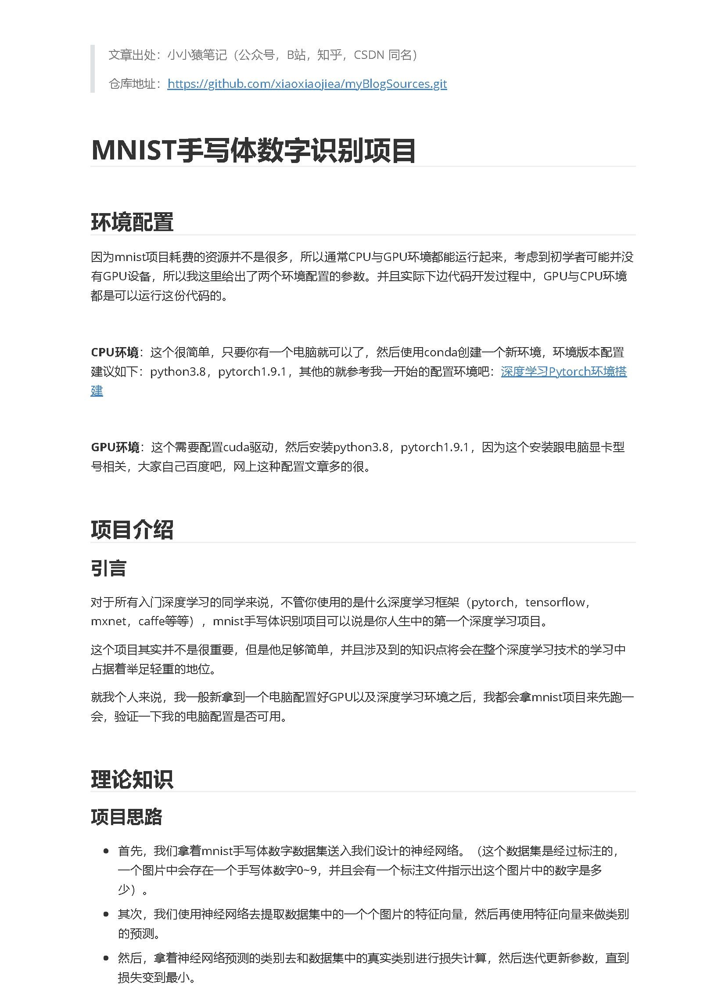
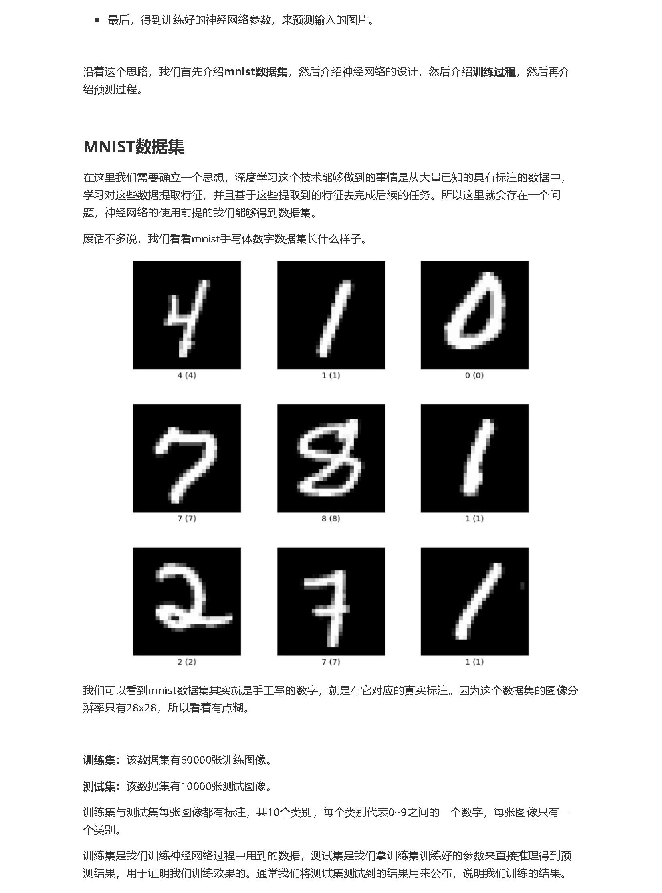
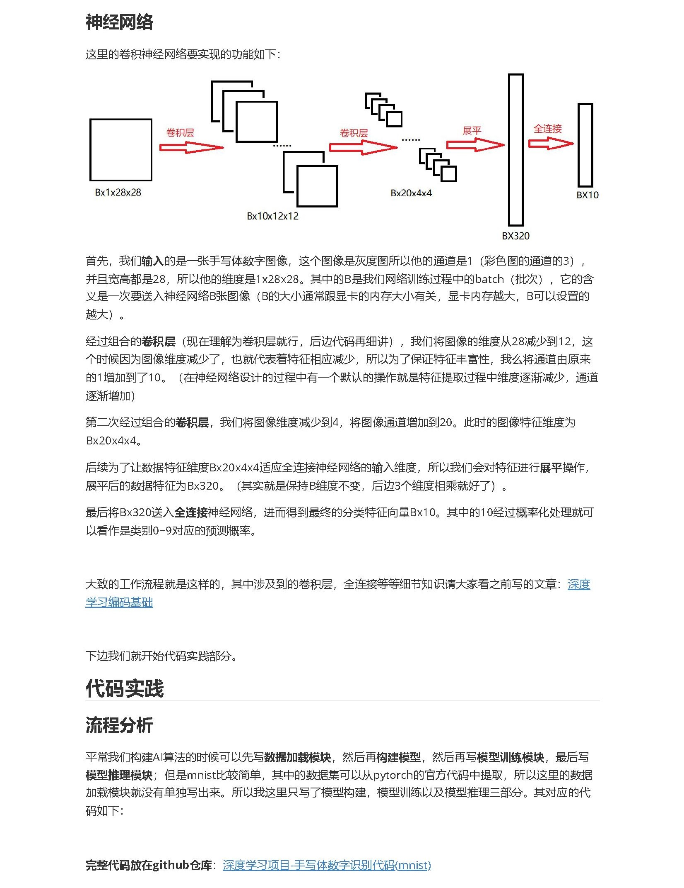
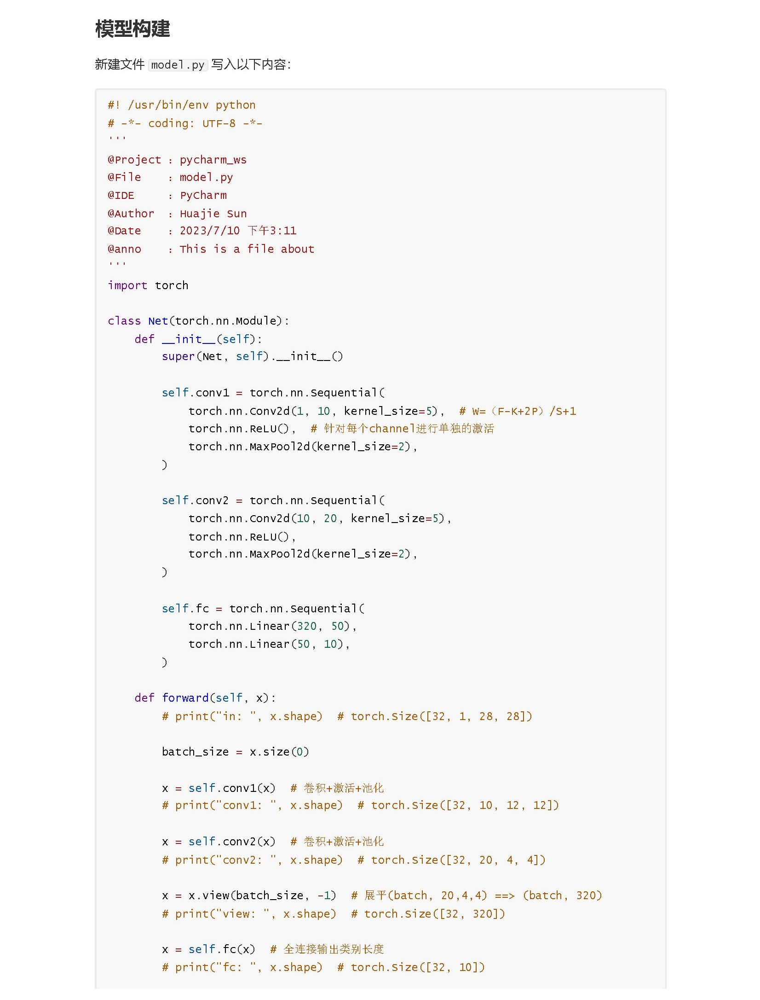
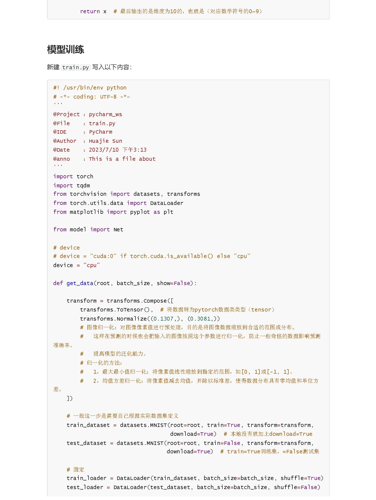
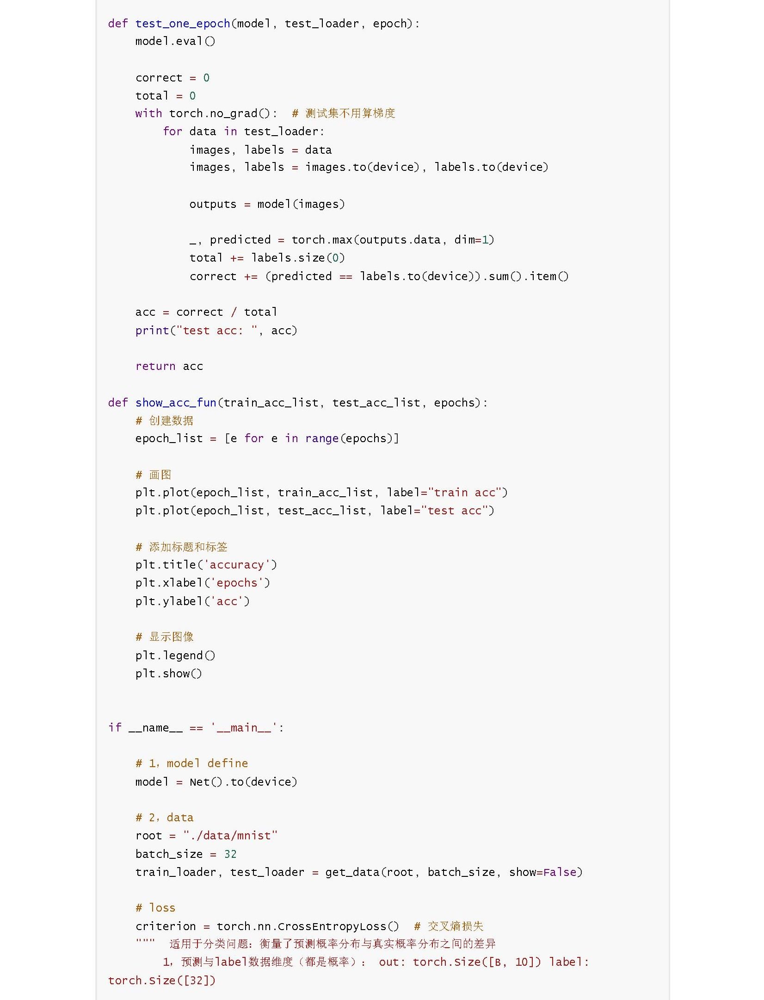
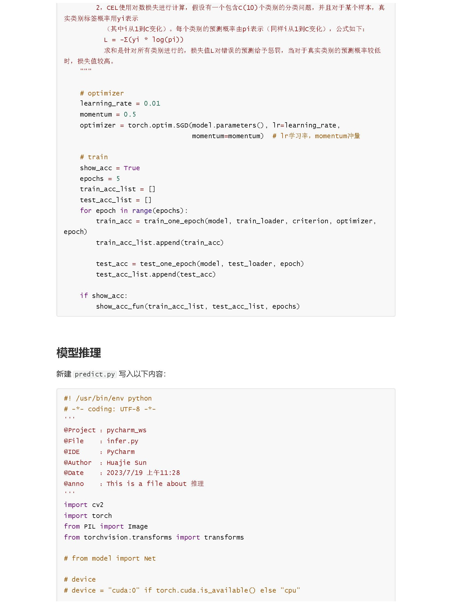
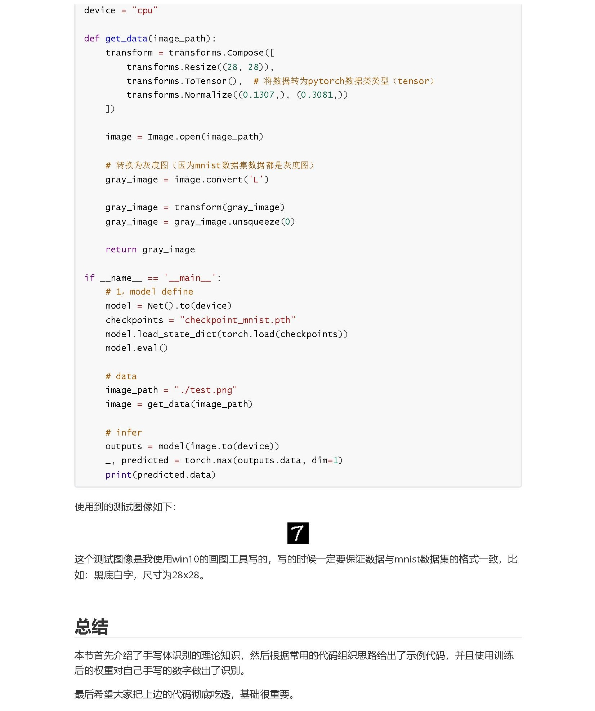

**Tips**：文中涉及到的链接已单独放置到文末，且可直接点击。

**链接**：

- 仓库地址：https://github.com/xiaoxiaojiea/myBlogSources.git
- 环境搭建：https://github.com/xiaoxiaojiea/myBlogSources/tree/main/ch001_deeplearning/%E6%B7%B1%E5%BA%A6%E5%AD%A6%E4%B9%A0%E5%9F%BA%E7%A1%80/001-%E6%B7%B1%E5%BA%A6%E5%AD%A6%E4%B9%A0%E7%8E%AF%E5%A2%83%E6%90%AD%E5%BB%BA
- 卷积层、全连接等历史文章：https://github.com/xiaoxiaojiea/myBlogSources/tree/main/ch001_deeplearning/%E6%B7%B1%E5%BA%A6%E5%AD%A6%E4%B9%A0%E5%9F%BA%E7%A1%80/003-%E6%B7%B1%E5%BA%A6%E5%AD%A6%E4%B9%A0%E7%BC%96%E7%A0%81%E5%9F%BA%E7%A1%80
- 完整代码：https://github.com/xiaoxiaojiea/myBlogShare/tree/main/DeepLearning/DL_base/mnist_code
- 测试图像：

