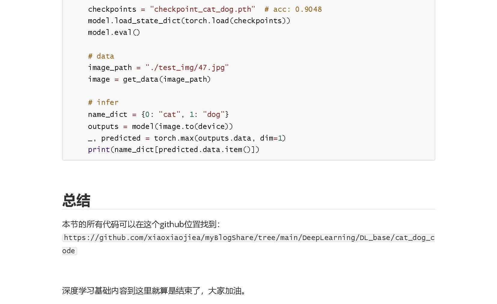

**Tips**：文中涉及到的链接已单独放置到文末，且可直接点击。

> 文章出处：小小猿笔记（公众号，B站，知乎，CSDN 同名）
>
> 仓库地址：https://github.com/xiaoxiaojiea/myBlogSources.git

**文中链接**：

- 环境配置：https://mp.weixin.qq.com/s/mu-ePQBKiWupaZxIXwVCgQ
- 猫狗分类数据集：https://www.kaggle.com/datasets/biaiscience/dogs-vs-cats
- 深度学习基础组件（卷积，池化，全连接）：https://mp.weixin.qq.com/s/E5XQ-W_wUfESiSkuUVpc1A
- 全部代码：https://github.com/xiaoxiaojiea/myBlogSources.git

