#  001-深度学习Pytorch环境搭建(Anaconda , PyCharm导入)


在开始搭建之前我们先说一下**本次主要安装的东西有哪些**。


- **anaconda 3**：第三方包管理软件。

> 这个玩意可以看作是一个大仓库，他里边含有很多Python的第三方开发库（也就是别人发布的，他收集起来管理）。安装好这个软件之后我们便可以使用这个大仓库来安装一些我们需要的包 （人工智能需要用的包也可以使用这个来装）。
>
> 同时，这个软件也可以管理我们的开发环境，让我们的环境看起来更加的简洁明了。


- **安装Pytorch**：深度学习使用的第三方包。

> 因为进行人工智能的开发需要进行一系列的求梯度（求导），正向传播，反向传播等等操作，如果每次都是人为的编写，有点太过于复杂了，所以Pytorch就可以理解为是将这些操作封装好的一个第三方库。我们安装好来使用即可。


## 1. 安装anaconda

> 安装包管理软件anaconda，用来管理我们人工智能所需要的包。


### 1.01 下载anaconda

> 下载主要通过2种方式：
>
> - 官网：**不推荐**，慢到爆炸。
> - 清华镜像：**推荐**，记得搭配第三方下载软件（不然浏览器下载也挺慢的），比如：迅雷。


#### 1.01.001 官方下载（不推荐）

> 这个方式**不推荐**，因为官网是外网，速度挺慢的，但是还是有必要介绍一下官网。


**官网下载地址**：[anaconda官方下载地址](https://www.anaconda.com/products/individual)


> 点进去之后，点击 `Download` 就会跳转到版本选择页面，选择对应的版本即可。

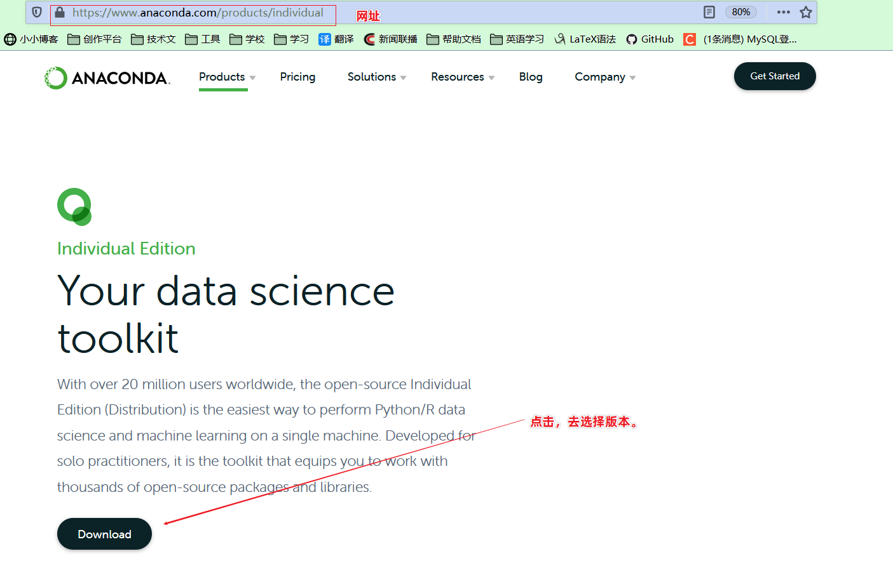

> 选择对应的版本，点击下载即可。

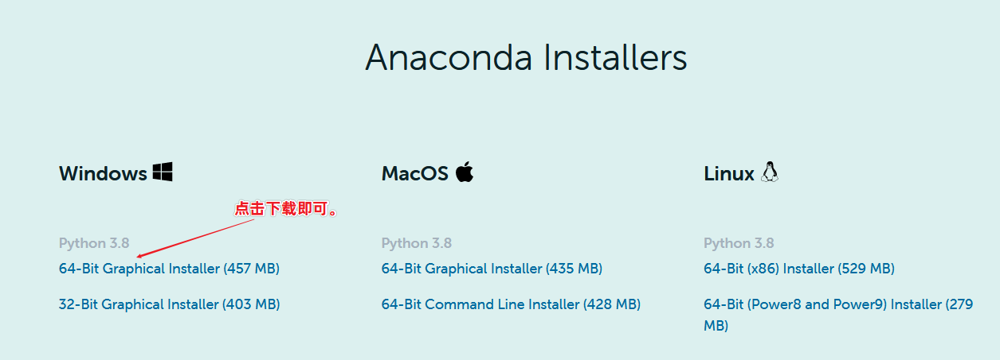


#### 1.01.002 清华镜像(推荐)

> anaconda的服务器是在国外，所以直接去它的官网下载，速度会很慢。
>
> 但是，我们国内有一些网站是专门用来收集软件的，`清华镜像源` 就是清华官方的一个网站，他里边收集了anaconda的安装包，我们可以去他的网站下载，服务器在国内所以速度还算不错。


**清华镜像源下载地址**：[清华镜像源下载地址](https://mirrors.tuna.tsinghua.edu.cn/anaconda/archive/?C=M&O=D)


> 进入之后，找到对应的版本 `Anaconda3-2020.02-Windows-x86_64.exe` ，点击下载即可。

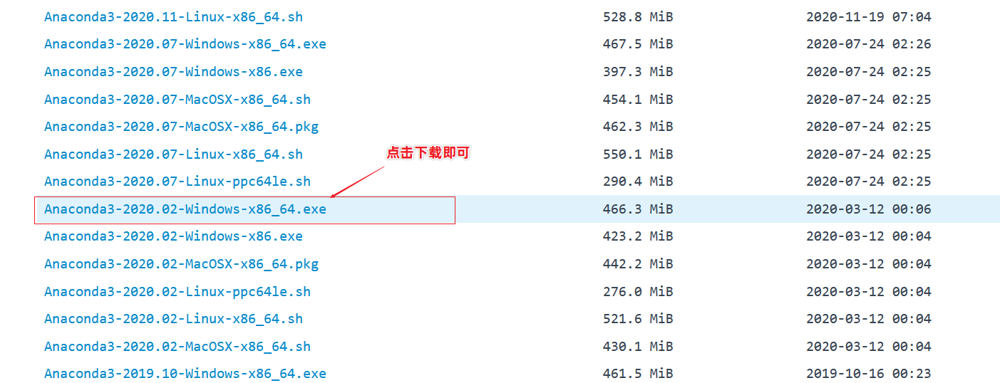

**tips**：可以把下载链接赋值入迅雷，下载更快。


### 1.02 安装anaconda

> 下载好了，就安装吧。


#### 1.02.001 安装前提示

- 千万别装 `C `盘。
- 安装的位置文件夹路径**千万别**有 `空格` 以及 `中文`。


#### 1.02.002 安装


- **step1**：新建一个文件夹，用于安装anaconda。

> 我这里是在 `E` 盘下新建一个 `Anaconda` 文件夹。  


- **step2**：双击下载好的软件，进行安装。

> 双击 `Anaconda3-2020.02-Windows-x86_64.exe`，等他加载，进行安装。

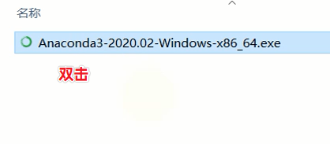

> 点击 `next`.

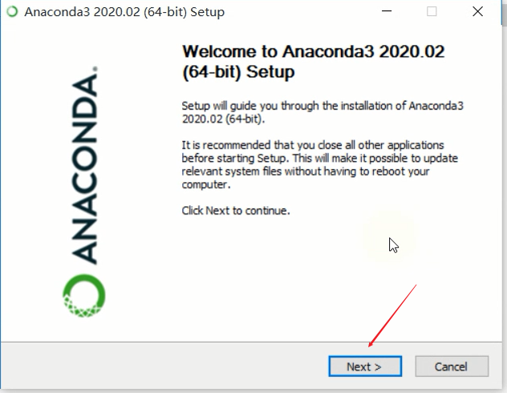


> 点击 `I Agree`。

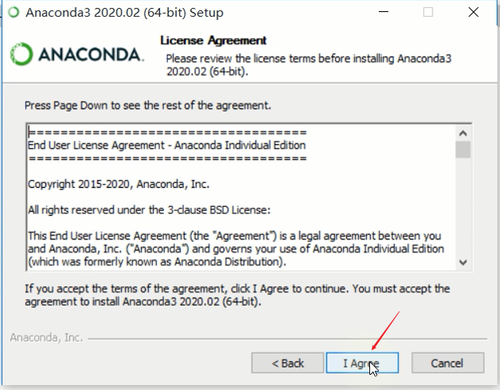


> 选中 `All User` , 点击 `Next`。

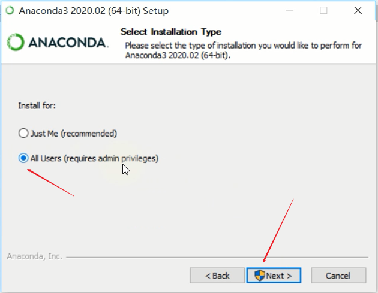

> 如果蹦出类似一下的框框，选择 `是` 即可。

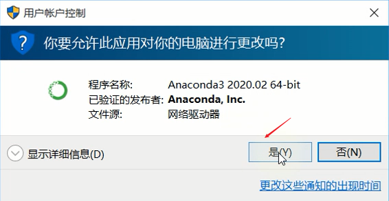


- **step3**：选择刚才新建的文件夹，点击 `Next`。

> 刚才我在 `E` 盘新建的 `Anaconda` 文件夹，我选中他就好了，你新建的啥，选中你自己的就好。（**千万不要有中文与空格**）

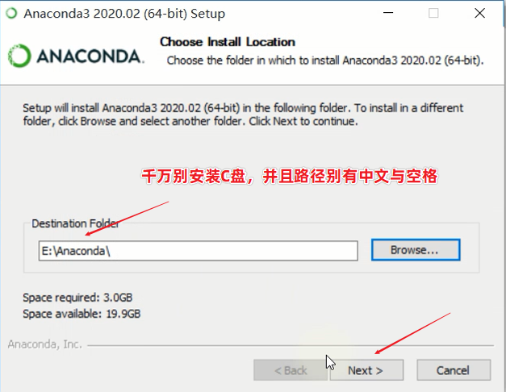


- **step4**：选中添加到环境变量（**一定要选**），然后点击 `Install`。

> 等待安装。

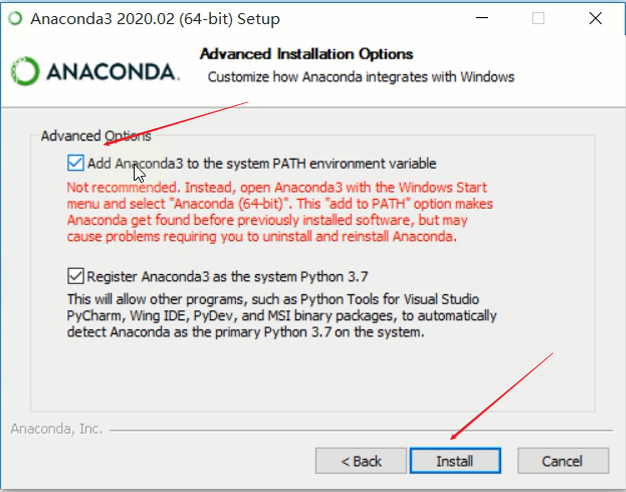

> 安装完成，点击 `Next` ，在 `Next`，

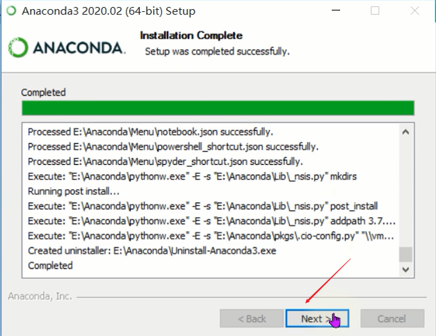

> 去点两个勾勾，点击`Finish`

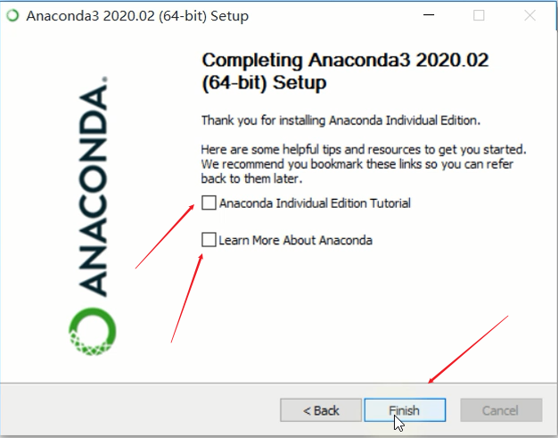

- **step5**：检查安装是否成功。

> 按键盘上的 `Win + r` 键，输入`cmd` 回车。

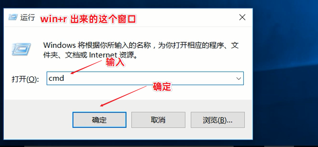

> 在出现的黑窗口中输入 `conda -V` 回车，出现版本号就是安装成功。

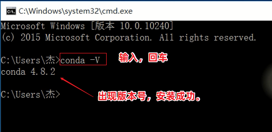

**安装完成。**


### 1.03 切换镜像源

> 首先需要弄明白什么是切换镜像源，为什么要切换？


#### 1.03.001 镜像源是啥

刚才我们说了，anaconda是一个大仓库，他里边有很多第三方开发库，但是不幸的是anaconda服务器在国外，如果直接使用anaconda下载第三方库的话，速度会很慢，速度慢到甚至会网络超时从而安装失败。

所以，我们将anaconda的**下载地址切换为我们国内的服务器**（称之为 镜像源），这样子使用anaconda下载的时候，就不会访问外国服务器下载了。


#### 1.03.002 切换镜像源


- **step1**：在黑窗口输入 `conda config --set show_channel_urls yes`  并且回车。

> 这一步的意思就是：我们输入命令，黑窗口会显示我们命令执行的情况。如果不设置，就看不到效果。


- **step2**：在黑窗口后输入 `conda config --add channels https://mirrors.tuna.tsinghua.edu.cn/anaconda/pkgs/free/ ` 并且回车。

> 这一步就是添加清华镜像源。

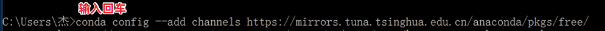


- **step3**：输入 `conda config --show channels` 并且回车。

> 看到以下的输出，就是成功。

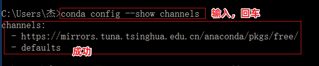


## 2. 创建Pytorch环境

> 上边已经安装好了anaconda，并且我们也知道anaconda是一个包管理工具，它可以用来管理我们的工作环境。
>
> 然后下边就使用anaconda来创建一下我们的Pytorch工作环境。


- **step1**：将`dos`路径进入到`anaconda`安装路径下的`Scripts`文件夹下。

> 首先打开`anaconda`安装路径下的`Scripts`文件夹。（我的安装在 `E:\Anaconda`，所以进入`E:\Anaconda\Scripts`）

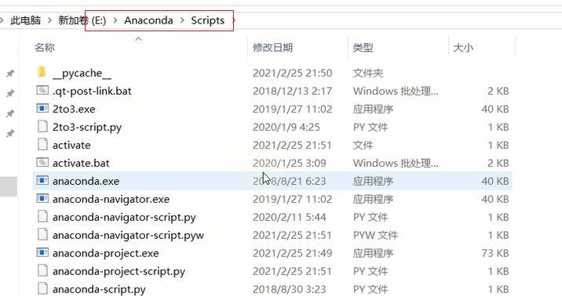

> 点击路径后边空白处。

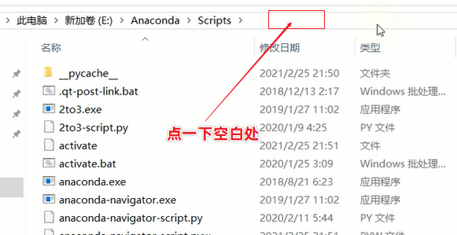

> 在路径蓝色的情况下，输入`cmd` , 回车进入 `dos`。

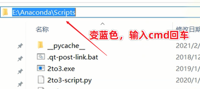

> 输入`cmd`回车

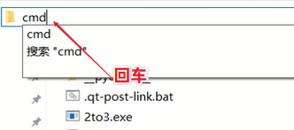

> 进入`dos`窗口，并且路径就是 `Scripts`文件夹所在路径。

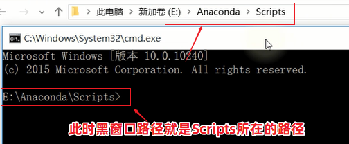


- **step2**：创建一个环境，用来安装Pytorch。

> 输入命令 `conda create -n pyTorchEnv python=3.7` ，点击回车。
>
> 其中`pyTorchEnv `是环境的名字，自己定义也可以。
>
> `python=3.7`是这个环境将使用3.7的python版本。

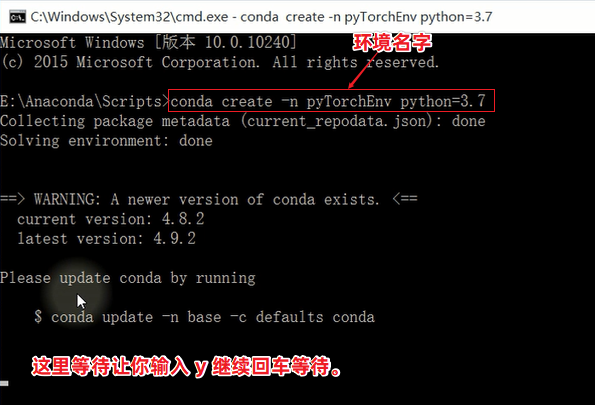

> 这里输入 y 回车。

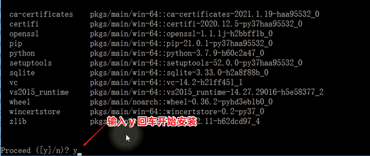


> 下边的样子就是安装成功。

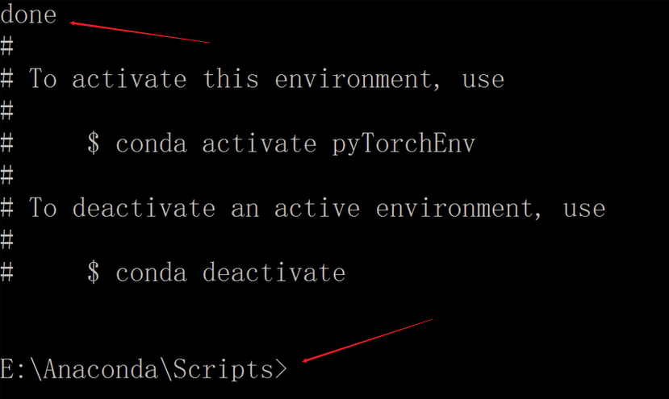

- **step3**：查看创建好的环境。

> 在anaconda安装路径下的envs文件夹下，会出现所有你创建的环境。

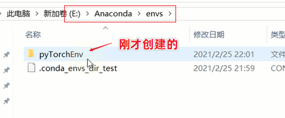

**这里只显示一个我们刚才安装的 pyTorchEnv 环境，但是还有一个默认的环境 base 也是存在的。**


- **step4**：激活测试创建好的环境。

> 先进入创建好的环境`pyTorchEnv`文件夹中，在进入他的`Scripts`文件夹中。
>
> **注意：不是 anaconda 的 Scripts 了**

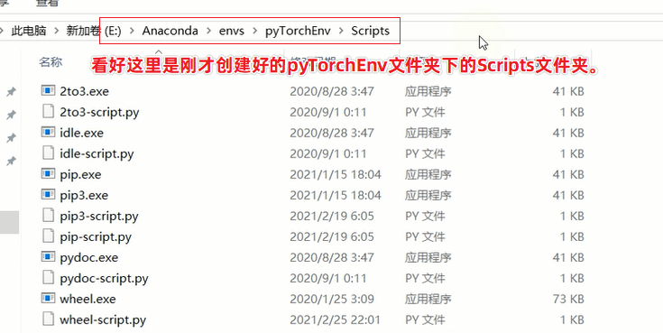

> 点击路径后边空白处，路径变蓝色之后，输入 `cmd` 然后回车进入`dos` 中。

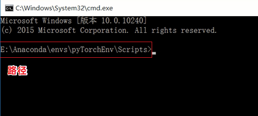

> 然后输入 `activate pyTorchEnv`，激活`pyTorchEnv`环境。

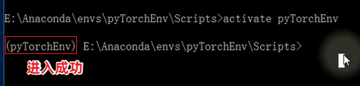

**激活成功就没有什么问题了**

> 退出环境：输入`deactivate` 回车即可。


## 3. 安装Pytorch环境

> 上边已经搭建好了深度学习的环境，接下来只用在这个环境中安装深度学习pytorch需要的库即可。


- **step1**：使用 `dos` 进入 `pyTorchEnv` 环境的 `Scripts`文件夹，然后激活`pyTorchEnv`。

> 方法同上边，找到 `pyTorchEnv` 中的 `Scripts` 文件夹，在路径栏输入 `cmd` 回车进入`dos`。
>
> 然后使用 `activate pyTorchEnv` 激活它。

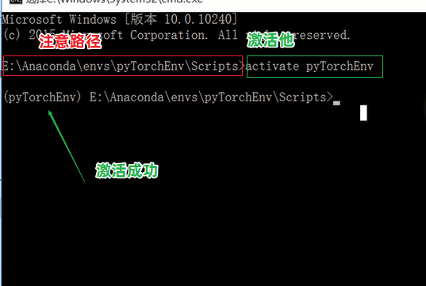

- **step2**：到pytorch官网找到安装命令。

> 官网地址：[pytorch官网](https://pytorch.org/).
>
> 到官网往下拉，然后配置的好你的版本。 （**这里先不要GPU哦。**）

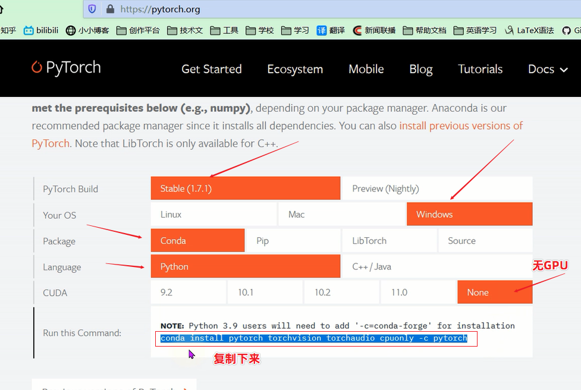

- **step3**：将复制的命令放入刚才打开的`dos`窗口，回车进行安装。

> 命令：`conda install pytorch torchvision torchaudio cpuonly -c pytorch` 

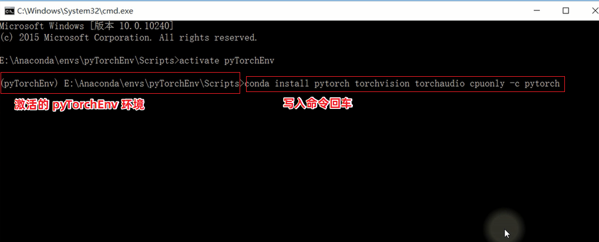

> 输入 `y`回车。

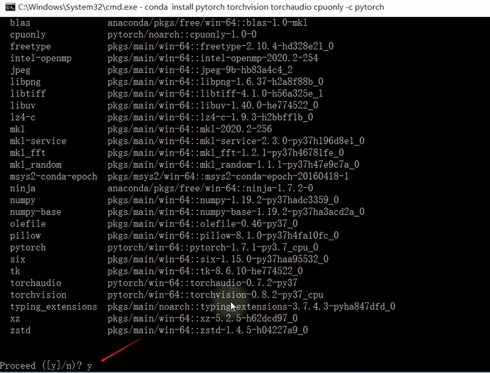

> 不报错就成功。

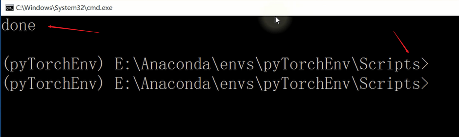

- **step4**：

> 还是进入到`pyTorchEnv`的`Scripts`中，进入`dos`，激活环境。

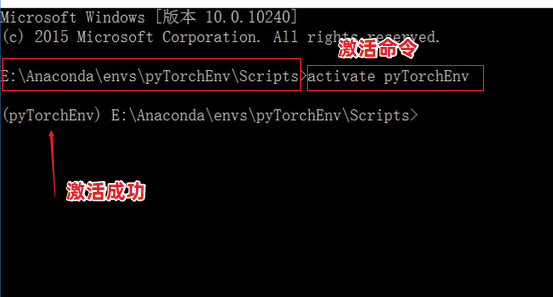

> 输入 python 回车，进入python中。


> 导入torch包，不报错就是成功。

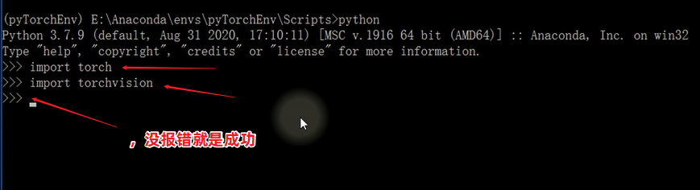


## 4. PyCharm导入Pytorch环境

> 上边创建好的环境我们需要把他导入PyCharm使用，不然只在黑窗口的话很不方便。所以这里就来演示怎么将`pyTorchEnv`环境导入PyCharm中使用。
>
> **tips**：
>
> - 这里我换电脑了，所以这里演示的时候，我的`anaconda`安装路径是 `D:\python\install\anaconda`。
>
> - 所以，我的pyTorchEnv文件夹的路径是：`D:\python\install\anaconda\envs\pyTorchEnv`。


- **step1**：新建PyCharm项目。

> 先打开PyCharm，点击新建。

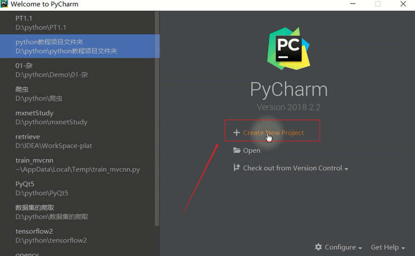

> 进入选择 pyTorchEnv。


> 进入选择。

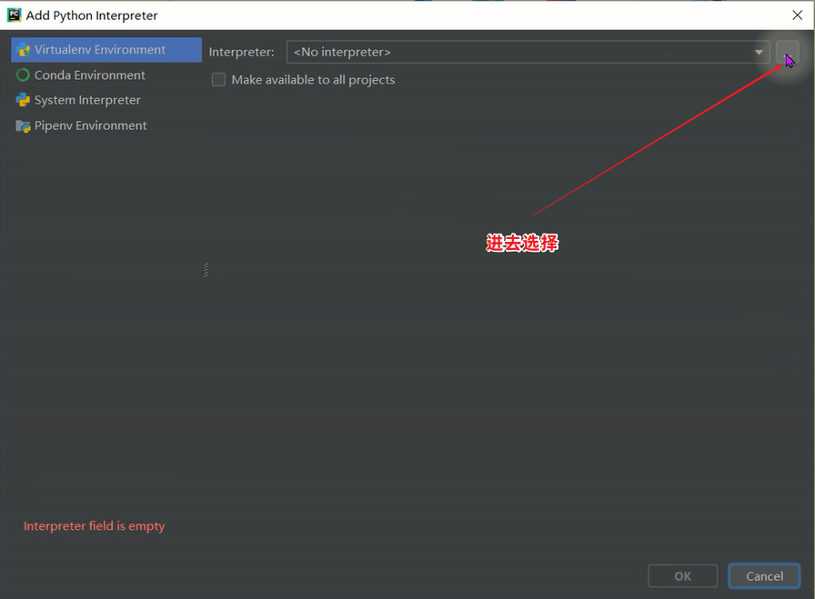

> 找到 pyTorchEnv 文件夹。

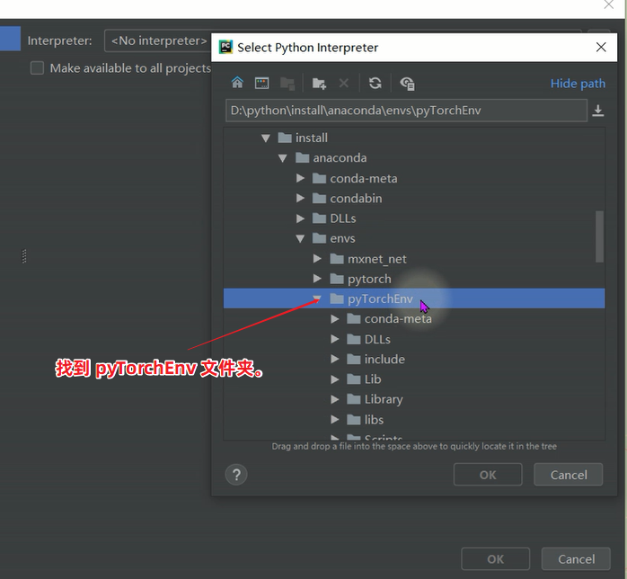

> 然后选中 pyTorchEnv 文件夹中的 python.exe 即可。

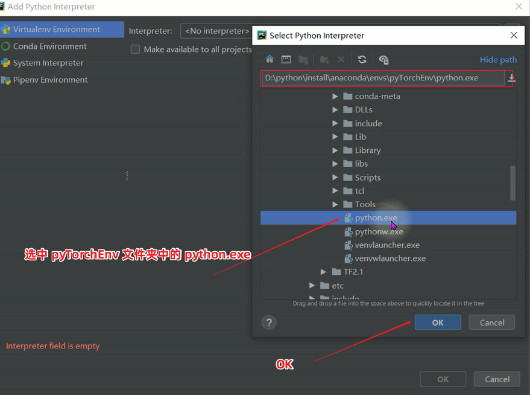

> 在 OK。

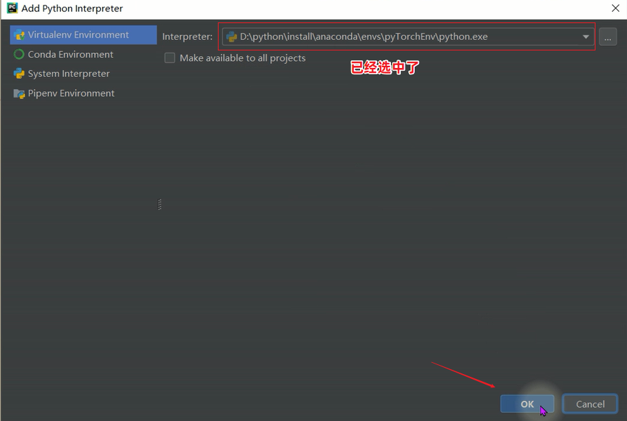

> 切换成功然后就可以了。

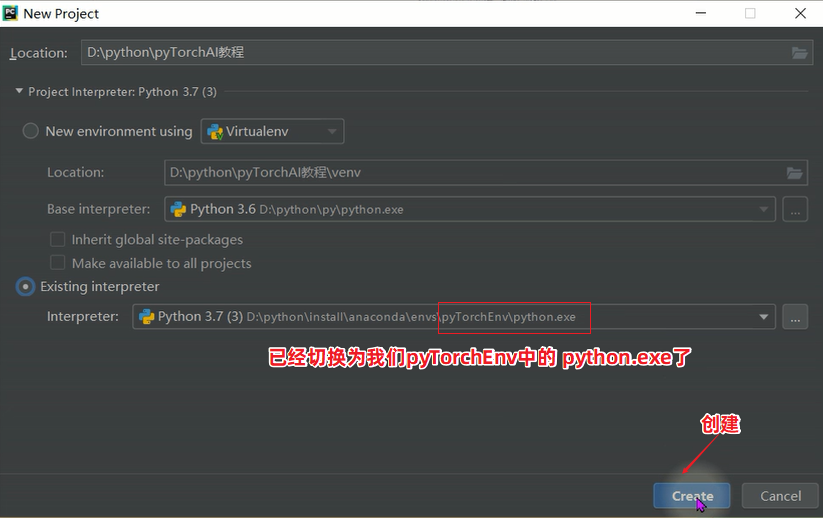

等待之后进入到PyCharm界面。

- **step2**：测试。

> 右键单击项目名字，新建一个 python package。然后自己起个名字。

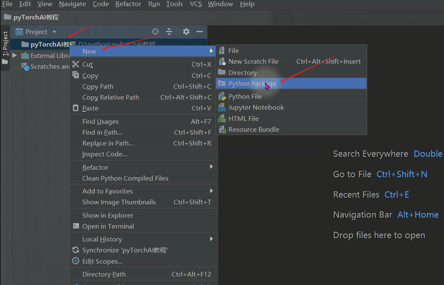

> 在 `__init__.py` 文件中输入以下代码，运行没报错就ok了。

```python
import torch
print( torch.cuda.is_available() )
```

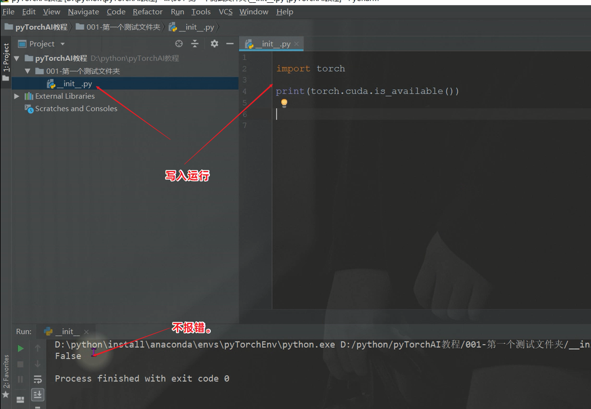

**OK, 搭建完成，以后的代码都是在这里敲。**


