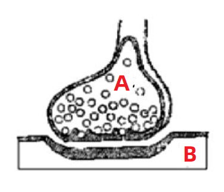
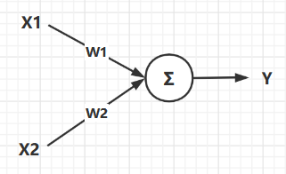
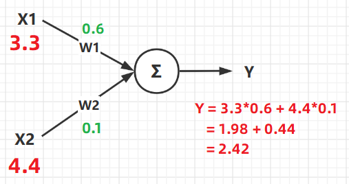
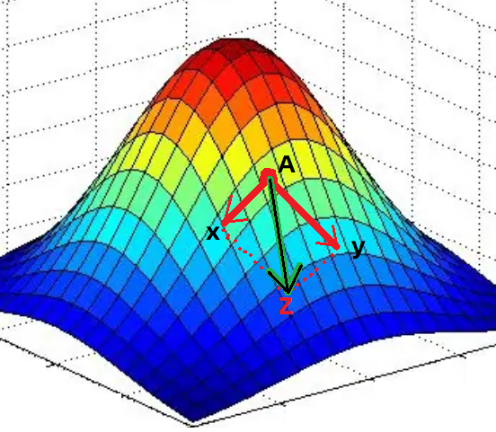
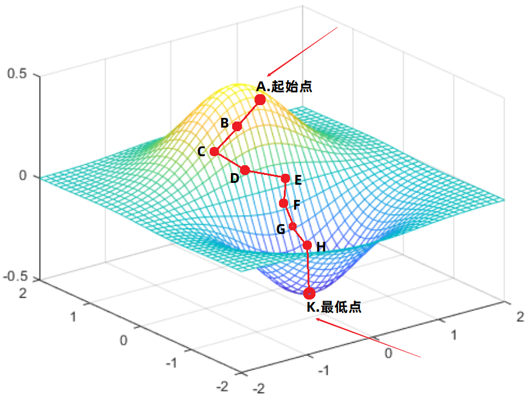

#  002-深度学习数学基础(神经网络、梯度下降、损失函数)

> 这里在进入人工智能的讲解之前，你必须知道几个名词，其实也就是要简单了解一下人工智能的数学基础，不然就真的没办法往下讲了。

**本节目录如下：**

- 前言。
- 监督学习与无监督学习。
- 神经网络。
- 损失函数。
- 梯度下降。

## 0. 前言

> 人工智能可以归结于一句话：**针对特定的任务，找出合适的数学表达式，然后一直优化表达式，直到这个表达式可以用来预测未来**。

**接下来就来一句一句的分析这句话：**

- **针对特定的任务：**

首先我们需要知道的是，人工智能其实就是为了让计算机看起来像人一样智能，为什么这么说呢？举一个人工智能的例子：

> 我们人看到一个动物的图片，就可以立刻知道这个动物是猫，还是狗。但是计算机却不可以，如果计算机可以分出类别，那么这就会是一个具有图像分类功能的人工智能小例子。

这里的`图像分类`就是我们所说的特定任务，这就是我们希望写出一个人工智能的程序来做的事情。

还有一些其他的常见的任务：`人脸识别`,`目标检测`,`图像分割`,`自然语言处理` 等等。

- **找出合适的数学表达式：**

学过高等数学并且有计算机思维的人都知道，世界中几乎所有的事情都可以用数学函数来表达出来，我们先不管这个数学表达式是离散还是连续，也不管他的次数多高，反正他能达到表示特定任务的一种目的。

比如说，针对一个西瓜质量好坏的预测任务，可以设出以下的表达式：
$$
f(x) = a*x_{1} + b*x_{2}^{2} + c*x_{3}^{3} + d
$$
**解释如下：**

>1、$$x1，x2，x3$$ 可以看作判断西瓜好坏的判断依据，比如可以是：瓜皮纹路，敲击声音，瓜皮颜色等等。
>
>2、$$a，b，c，d$$ 就是这个表达式的系数，一旦数学表达式定下来了，那么接下来需要做的事情就是找出合适的系数，使得这个表达式可以很好的判断出西瓜质量的好坏。

所以，针对上文提到的特定任务，都可以用数学表达式表示出来，当然，我们会尽可能找简单、高效的表达式。

- **一直优化这个表达式：**

上边引出表达式之后，会发现当表达式确定下来之后，就要**寻找合适的系数**了，寻找系数的过程就被称之为训练网络的过程。

我们优化表达式的重要思想是：**一直调整系数值，使得预测出的数据 与 真实数据之间的差距尽可能的最小。** 

比如：假设**预测的数据**是 $$f_{1}(x)$$，**真实数据**是$$y$$，我们通过一直改变系数的值，来找出可以使得预测数据与真实数据之间距离最小的一组，最小的一组数据就是我们需要的系数。

其中，距离计算公式可以是如下的表达式：
$$
loss = \sqrt{(f_{1}(x) - y )^2 }
$$
通过这个表达式，得到的 `loss` 值就是真实值与预测值之间的距离。

然后，接下来的优化就是针对这个`loss` 表达式来进行的，目的就是让`loss`的值达到最小。

因为`loss`值达到最小的时候，就意味着我们的预测值与真实值距离很相近，预测越准确。

> 这里值得一提的是，这里的`loss`表达式的优化过程，其实就是将`loss`公式对函数`f(x)`的系数求导。
>
> 所以当`loss`最小的时候，就意味着此时的系数最合适。
>
> 具体的细节往下看。

- **用优化好的表达式预测未来：**

经过上边的优化，此时函数会得到一个相对好一点的系数，然后就可以使用这个函数来预测未来的事情了。

这就是达到了人工只能的目的了。

**所以，下边我们就要仔细讨论，数学表达式的构建，距离函数的构建，距离的优化。**

## 1. 神经网络

> 神经网络的英文是：neural network （简称：NN）。

神经网络其实就是变形的数学表达式，它通过拼装基础组件（神经元）来**模拟出数学表达式**。

### 1.01. 什么是神经网络

一说神经网络，大家首先想到的就是神经元，其实没错，神经网络这个名词就是从神经元这里演变过来的。所以我们做一下类比。

#### 1.01.001. 神经元

如图所示，这个图就是我们人体的神经元的放大图。

通常我们身体的 `A` 部位发出的命令，要指挥 `B` 部位响应，就要通过 `A` 向 `B` 发出信号。这个信号的强弱影响着 `B` 反应的强弱。

所以，这就是神经网络的构思所在：

**构建出一个类似于神经元的结构，上一个节点的==输入==（A处的控制）  以及==权重==（信号的强弱）共同决定下一个节点的==输出==（B处的反应）**。

> 这句话，现在看不懂没关系，有个印象就好，继续往下看吧。

#### 1.01.002. 神经网络

如图所示就是一个最简单的神经网络结构，这个结构的数学表达式是：$Y = X1*W1 + X2*W2$ 。

图中的圆圈我们就把他类比于神经元，图中的各个结构解释如下：

- 其中 `X1,X2` 就是这个神经网络的**输入**，他相当于就是人体大脑发出的控制命令。
- `W1,W2` 就是**权重**，他是用来控制不同输入信号占比大小的数据，比如：想让控制`X1`作用明显一点，那么对应的`W1`就大一点。

- `Y` 就是**输出**，他就是输入数据与权重作用之后的最终结果，在神经元中也就是最终对身体某个部位的控制信号。

### 1.02. 神经网络的数学原理

神经网络的数学原理非常简单，简单总结下来就是一句话：**不同的输入**作用于**各自的权重**之后**的和**即为我们需要的结果。

> 其实就可以大致理解为我们的函数 ： $$f(x) = a*x1 + b*x2$$  一样，所谓的权重就是我们方程的系数。

细心的人观察上边的公式就会发现，一**个神经元节点**就可以**归结于一个运算式子**。所以我们这里就来针对上图，分析分析含有一个神经元节点的公式。

从图中可以看得出来，最终的输出结果 `Y` 是由 `输入（X）` 以及 `权重（W）` 共同决定的。

他们最终的计算结果 `Y` 其实说白了就是一个计算公式：$Y = X1*W1 + X2*W2$ ，这个公式的含义大家应该都明白，**给不同的输入 分配不同的权重 ，从而得到想要的结果。** 

这就是神经网络中一个神经元的数学原理，当把神经元的个数增多之后，原理以此类推，只不过是要增加权重`W`以及输入`X`的个数而已。

**下边就可以看作是一个，含有两层的神经网络结构。**

- 第一层节点： `11`，`12`，`13 `   。第二层节点： `21`  。

- 输入： `X1` ，` X2 ` 。  输出 ： `Y`  。

于是，根据公式：**输出** 等于 **输入**作用于 **权重**， 得出以下推导 ：

- 输入： `X1` ，` X2 ` 。
- 节点`11`的值： $$Y_{11} = X_{1} * W_{1-1} + X_{2}*W_{2-1}$$  .
- 节点`12`的值： $$Y_{12} = X_{1} * W_{1-2} + X_{2}*W_{2-2}$$  .
- 节点`13`的值： $$Y_{13} = X_{1} * W_{1-3} + X_{2}*W_{2-3}$$  .

- 节点`21`的值就是最终输出 `Y` ： $$Y = Y_{21} = Y_{11} * W_{3-1} + Y_{12}*W_{3-2} + Y_{13}*W_{3-3}$$  .

**所以，最终的整合式子为：** 
$$
Y = Y_{11} * W_{3-1} + Y_{12}*W_{3-2} + Y_{13}*W_{3-3}  \\
= (X_{1} * W_{1-1} + X_{2}*W_{2-1})*W_{3-1}    \\ + (X_{1} * W_{1-2} + X_{2}*W_{2-2})*W_{3-2} \\+ (X_{1} * W_{1-3} + X_{2}*W_{2-3})*W_{3-3}
$$

**于是，我们可以发现，类似于这样的堆叠方式，我们可以组合成很多的数学函数。**

> 这就是神经网络，他的目的在于将数学公式堆砌出来，至于为什么要这样堆砌，是因为**这样堆砌计算机计算比较方便**呗。 

### 1.03 总结

到目前为止你已经知道了神经网络的由来，并且知道神经网络与数学公式之间的关系。

**此时你需要明确的知识点是：**

- **人工智能就是使用已有的数据，拟合出一个可以用来预测未来的公式。**
- **这个公式的系数需要一直调整，从而找出一组最为合适，正确率较高的系数。**
- **因为系数的寻找需要大量的计算，所以需要将这个公式用神经网络表示出来的，因为在计算机中这样表示的时候计算最为方便。**

## 2. 监督学习与无监督学习

> 这个知识点比较简单，就一些单纯的概念。

**监督学习**：就是我们收集到的数据是有标签的。

> 就是说，我们收集到的数据是已经分好类的。
>
> 比如说：当前当前有一批样本数据，
>
> -  `x1, x2, x6, x9, x13`属于类别`y1`类。
> -  `x3, x4, x5, x8, x11`属于类别`y2`类。
> -  `x7, x10, x12`属于类别`y3`类。

然后接下来我们使用这些数据的时候，就可以使用已有标签的数据，去拟合出曲线，用以预测未来。

**无监督学习**：我们收集到的数据是无标签的。

> 就是说，收集到的数据并没有固定的类别，我们需要做的事情就是挖掘数据内部的联系，给他们聚类，找出类别。

如图所示，挖掘出数据内部的联系，让他自动归类。

## 3. 损失函数

> 上边解释过了，损失函数的作用就是计算 **真实值** 与 **预测值** 之间距离的 （距离其实可以简单理解为两个数据之间的差距）。

这里介绍一些常见的几种损失函数，以供大家入门使用。

### 3.01. 一些前提

> 这里给定一些大前提，下边的几种损失函数通用的那种。

- **真实值**：`y` ，他就是针对某一组输入`x`的真实标签。
- **预测值**：`f(x)`，他就是针对输入`x`的预测标签。
- **样本数**：`m`，他就是我们每次输入多少样本进行计算，比如：某一次输入`5`组`x`，得到`5`个预测结果，这里的`m=5`.

### 3.02. 绝对值损失函数

> 其实就是简单的计算 真实值 与 预测值 之间的绝对值距离而已。

**公式**：
$$
J(y,f(x)) = J(w,b) = \frac{1}{m}\sum^{m}_{i=1}|y_{i}-f(x_{i})|
$$
**解释**：

- $$J(y,f(x))$$ 的意思就是，这个损失函数的参数是：真是标签`y` 与 预测数据`f(x)`  。
- $$J(w,b)$$ 的意思是，这个损失函数的目的是优化参数 `w` 与 `b` 。这里的`w`，`b`其实就是系数的矩阵形式。
- 后边具体的计算公式就是：输入有`m`个样本，计算出这`m`个样本的距离绝对值和，然后再求均值。

### 3.03 均方差损失函数

> 就是将上边式子的绝对值换成平方就好了。

**公式：**
$$
J(y,f(x)) = J(w,b) = \frac{1}{2m}\sum^{m}_{i=1}(y_{i}-f(x_{i}))^2
$$

**解释：**

- 这里只是将绝对值换成了平方，除以`m`换成了除以`2m`。

### 3.04 交叉熵损失函数

> 这个就比较麻烦了，交叉熵损失函数一般用于解决分类问题。

**标签**：

在通常的分类问题中，标签`y`的取值一般只有 `0` 或 `1` 。 

> 1 表示是当前类别， 0 表示不是当前类别。

**公式：**
$$
J(y,f(x)) = J(w,b) = -\frac{1}{m}\sum^{m}_{i=1}(\ f(x)*log(y) + (1-f(x))*log(1-y)\ )
$$

**解释：**

- 上边说了，`y` 与 `f(x)` 都只能取 `1` 与 `0` 中的一种可能性。所以，上述公式的效果就是：
- **如果 y与 f(x) 相同，则 J = 0**.

> 你带入 y=1 , f(x)=1 试试就知道了。

- **如果 y与 f(x) 不同，则 J = 无穷大**.

> 你带入 y=1 , f(x)=0 试试就知道了。

### 3.05 总结

到这里你已经学习了三种常见的损失函数。

**此时你应该有一个明确的知识点就是：**

- **损失函数是用来计算真实值与预测值之间距离的。**
- **当损失函数的值越小就代表着真实值与预测值之间的距离就越小，也就意味着预测的越准。**

## 4. 梯度下降

> 好了好了，上边过完理论知识，这里来一个真真正正的数学内容了，其实不难，看我慢慢分析。

- 上边我们提到对数学函数优化的时候，只是介绍了理论的知识。

> 我们知道了损失函数就是衡量预测值与真实值之间距离的公式。
>
> 并且知道，损失函数的值越小，真实值和预测值之间的距离越小，也即：预测的越准。

- 但是并没有带着大家深入探究如何优化。

> 也就是没有告诉大家怎么使得损失函数的值越来越小。

**其实，这里使用的数学知识就是 ：求偏导**

### 4.01. 数学例子

> 这里以一个简单的数学例子来引入梯度下降的内容。

- **场景引入**

> 在数学课中我们经常做的一个题型就是：已知一个函数`f(x)`的表达式，如何求出这个式子的最小值点。

在数学题中我们经常用的方法就是：将函数`f(x)`对`x`求导，然后令导数式子为`0`，求出此时的`x`的值，即为最小值点的位置。

- **具体例子**

> 求函数 $$f(x) = 2*x^2-12*x+20$$ 的最小值点，并且求出最小值。

**对函数求导**
$$
f(x)' = 4*x - 12
$$
**令导函数为0，求出此时的x**
$$
令 \  \ f(x)'=0 \\
即 \ 4*x-12 = 0  \\
得到\ x=3
$$
此时，`x = 3` 即为函数 `f(x)` 的最小值点，带入原方程 `f(3)= 2*9-12*3+20 = 2`.

> 这个解题过程，想必大家都很熟悉吧。

**下边就分析一下这个过程的数学原理了**

### 4.02. 数学例子原理

> 梯度就是导数。

针对上边提到的方程的最小值求解，其实就是求出其梯度（导数）为`0`的位置，就是其最低点的位置。具体看下图：

- 方程  $$f(x) = 2*x^2-12*x+20$$  图像如下：

> 从图中可以看出，方程在不同位置的导数方向是不同的，只有在最低点的位置，导数为`0`，所以可以用导数为`0`的位置求出最低点。

**上边举的例子是一个比较简单的例子，方程中只有一个未知数，但是在真实情况中，往往一个方程有很多未知数。**

- 比如：$$ f(x,y)=2*x^2+2*y+4*x*y $$

> 此时需要做的事情就是针对每一个变量求偏导，**求出该方程针对每个变量的梯度方向** （梯度方向就是数据变小的方向）。

**于是，在方程的每个点上，都有多个梯度方向，最终将这多个方向合并，形成这个点的最终梯度方向 （数据变小的方向）**

> 如图，方程有两个变量`x`,`y`，于是在A点针对两个变量求偏导就可以得到各自的梯度方向（两个红色箭头的方向）。
>
> 然后，将两个梯度进行合并，得到最终的梯度方向`Z` 。**Z方向就是方程在A点数据变小的方向了**。

### 4.03. 完整例子

> 上边讲完原理，这里就举出一个例子，带着大家走一遍梯度下降找最小值的过程。

假设此时的方程已知，并且根据方程绘制出的图像如下。

- 刚开始我们位于A点：

> 1、在A点处针对方程的各个变量求出偏导，于是便可以得到方程针对各个方向的梯度方向。
>
> 2、将A点处各个方向的梯度方向进行合并，形成最终的梯度方向。
>
> 3、最终的梯度方向就是AB方向。
>
> 4、于是向着AB方向走出一段距离，走到了B点。

- 到达B点： （思路同上）

> 1、求出B点处各个方向的梯度方向，然后合并所有梯度方向，得到最终的B点处梯度方向 BC。
>
> 2、于是沿着BC方向，走出一段距离，到达C点。

- ...重复上述过程：

> 到达某个点之后，求出各方向的偏导数，然后合并得到最终的梯度方向。
>
> 然后沿着合并后的梯度方向走出一段距离到达下一个点。
>
> 然后在一直重复......

- 到达K点：

> K点就是最终的点，这就是优化得到的最重点。

**这就是整个找最小点的可视化过程，但是其中提到更新的数学细节并没有提到，所以下边提一下用到的数学更新公式吧**

### 4.04. 更新公式

> 一般我们梯度下降更新的数据只有函数的系数，然后函数的系数可以分为两类：权重（W）+偏差（b）
>
> 所以，更新的时候也就针对这两个参数就好了。

**变量定义：**

- `W` ： 方程的权重。 （可以简单理解为方程变量前面的系数）
- `b` ：方程的偏差。 （可以简单理解为方程中的常数）

> 比如：$$f(x,y) = 2*x^2+y^2+3$$ 中，`2 , 1`就是权重，`3`就是偏差。

**公式：**

- 更新权重`W`：$$W_{new} = W_{old} - \alpha *\frac{\partial L}{\partial w}$$.

> 原始点的权重是 $$W_{old}$$，原始点此时针对`W`的梯度方向是$$\frac{\partial L}{\partial w}$$.
>
> $$\alpha$$ 就是一段距离长度（它就是我们上文一直提到的走一段距离）。
>
> 所以 $$\alpha *\frac{\partial L}{\partial w}$$ 表达的含义就是沿着 `W`的梯度走一段长度为$$\alpha$$ 的距离。
>
> 
>
> 然后 **新的`W`** 就是 **旧的`W`** 减去那一段**方向长度**。

- 更新偏差：$$b_{new} = b_{old} - \alpha *\frac{\partial L}{\partial b}$$.

> 原理同 `W` .

**这就是更新参数的整个梯度下降过程了。**

## 5. 总结

到目前为止，基础的人工智能知识已经基本讲完了，这个时候我们再来仔细品味这句话。

**针对特定的任务，找出合适的数学表达式，然后一直优化表达式，直到这个表达式可以用来预测未来**。

或许你就会有不一样的体会了。

ok，下一节就讲一讲Pytorch的基础使用，然后就是最终的手写体数字识别任务了。

